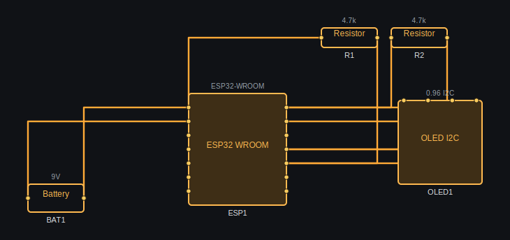

# Cluster

**Beginner-friendly ESP32/Arduino schematic, simulation, and PCB design.**

Cluster is an ESP32/Arduino learning and prototyping tool focused on making electronics accessible to makers, students, and hobbyists. It is not trying to clone all of KiCad; the goal is a beginner-friendly KiCad-lite workflow: easier than KiCad, more electrically aware than Fritzing, and capable of growing from schematic validation into practical two-layer PCB output.

Cluster is designed to work offline. Circuit files stay local unless you choose
to share or export them.



The image above is generated by Cluster's own SVG exporter from the built-in
ESP32 + OLED lesson. Regenerate it with:

```bash
cargo run -- --export-demo-svg docs/media/cluster-overview.svg
```

---

## Why Cluster?

| Tool | Ease of use | Smart validation | DC simulation | ESP32 focus |
|---|---|---|---|---|
| KiCad | Hard | ✅ | External (SPICE) | Generic |
| Fritzing | Easy | ❌ | ❌ | ✅ |
| Tinkercad | Easy | ✅ | ✅ | Limited |
| **Cluster** | **Easy** | **✅** | **✅** | **✅** |

Cluster is **easier than KiCad**, **smarter than Fritzing**, and **focused on real beginner circuits**.

---

## Features

### Circuit Design
- Drag-and-drop component palette with search
- Orthogonal wire routing with T-junction detection
- Grid snapping and zoom/pan
- Breadboard View wiring assistant for ESP32/Arduino I2C examples
- CAD data model groundwork for symbols, footprints, net classes, board layers, tracks, vias, and DRC
- Multi-page schematics
- Component labels, values, and rotation
- Undo/redo (80-step history)
- Copy/paste and group selection
- Find, align, and distribute components

### Breadboard View

The Breadboard View is a beginner wiring assistant synced from the schematic netlist. It currently recognizes ESP32/Arduino + OLED/Sensor I2C circuits and checks the core jumpers:

- ESP32 GPIO21 -> OLED/Sensor SDA
- ESP32 GPIO22 -> OLED/Sensor SCL
- Arduino A4 SDA -> OLED/Sensor SDA
- Arduino A5 SCL -> OLED/Sensor SCL
- VCC/3V3/5V and common GND rails

Clicking a guided jumper highlights the matching schematic net so learners can connect the abstract schematic to the physical breadboard wiring.

### Supported Components
- **Microcontrollers**: ESP32, ESP32-S3, ESP32-C3, Arduino Uno, Raspberry Pi Pico
- **Passives**: Resistor, Capacitor, Inductor, Potentiometer, Thermistor, Varistor
- **Diodes**: Standard, LED, Zener, Schottky, TVS, Phototransistor
- **Transistors**: NPN, PNP, N-MOSFET, P-MOSFET
- **Power**: Battery, Voltage source, Current source, Voltage regulator, Voltage reference
- **Switches**: Toggle switch, Push button, Slide switch, Relay
- **ICs**: Op-amp, 555 Timer, Logic gates (AND/OR/NOT/NAND/NOR/XOR), Generic IC, Optocoupler
- **Peripherals**: OLED display, DC motor, Servo, Sensor, Motor driver, 7-segment display
- **Misc**: Crystal, Transformer, Fuse, Lamp, Breadboard, Net label

### PCB / Manufacturing Direction

Cluster now has the first internal data model needed for PCB work:

- Schematic `SymbolInstance` data separate from physical `Footprint` data
- `NetClass` rules for clearance, track width, via diameter, and drill
- `Board` data with outline, layers, footprints, tracks, vias, zones, and design rules
- Initial DRC checks for minimum track width and via sizes
- Gerber/Excellon string generators for future file export

This is groundwork, not a finished PCB editor UI yet. The intended MVP is footprint placement, ratsnest display, manual track drawing, vias, two copper layers, DRC, and Gerber/Excellon export.

### Validation (ERC)

Cluster runs automatic Electrical Rule Checks after every change:

**Errors (must fix):**
- Power short: supply connected directly to GND
- No GND reference in schematic
- ESP32/Arduino 3.3V pin connected to 5V rail
- GPIO driving a motor directly (use a driver IC)
- GPIO driving LEDs, relay coils, servos, or lamps without appropriate protection
- Reversed LED polarity (anode on GND net)
- Reversed diode polarity
- OLED SDA/SCL lines swapped

**Warnings (should fix):**
- LED without a current-limiting resistor
- Resistor with no resistance value
- Battery or voltage source with no voltage value
- Floating wire not connected to any component
- Unconnected component pin
- Missing I2C SDA/SCL pull-up resistors
- Relay coil without a flyback diode

Clicking a validation message selects the offending component or wire on the canvas.

### DC Simulation

Cluster uses Modified Nodal Analysis (MNA) to compute:
- **Net voltages** — voltage at every node in volts
- **Branch currents** — current through every component in amps
- **Component power** — power dissipated in watts

Simulated components: Resistor, Battery, Voltage/Current source, LED (Vf≈2V), Diode (Vf≈0.65V), Zener, Schottky, Switch (open/closed), Potentiometer, Fuse, Lamp, DC Motor approximation, NPN/PNP transistor (linearised), MOSFET (threshold switch), and relay coil/contact connectivity.

The built-in solver is an educational DC operating-point solver. Capacitors are open in DC, inductors are short in DC, and transient effects such as RC charging, PWM, motor startup, and waveforms are not simulated. Symbolic components are marked as not simulated in the inspector and ERC.

Energized wires are highlighted in orange. Voltage labels can be toggled on
wires. Open circuits can retain a valid node voltage while displaying `0 A`.
When one stored wire polyline contains a branch and therefore carries different
currents on different segments, Cluster suppresses a misleading single current
arrow and reports that the current varies at the junction.

### Built-in ESP32/Arduino Lessons

- Example Gallery entries are available from the left palette.
- ESP32 + OLED with 4.7k I2C pull-ups
- ESP32 + I2C sensor with 4.7k pull-ups
- ESP32 button debounce and LED output
- ESP32 motor-driver wiring
- Arduino UNO + LED
- Arduino UNO + OLED with 4.7k I2C pull-ups

### Export
- **SVG** — schematic as a scalable vector graphic (`cluster_circuit.svg`)
- **SPICE netlist** — educational `.op` netlist for LTspice/ngspice (`cluster_circuit.cir`)
- **BOM CSV** — bill of materials for part ordering (`cluster_bom.csv`)
- **Arduino code** — starter sketch for connected ESP32/Arduino GPIO, buttons, LEDs, and OLED I2C wiring

SPICE export includes supported primitive models and comments for skipped
symbolic parts. Arduino export is a starter sketch, not firmware synthesis; it
does not infer application behavior for arbitrary modules.

### Save & Load
- JSON format with schema version tracking
- Automatic `.bak` backup before every manual save
- Autosave to `cluster_autorecover.json` every 30 seconds
- Corrupt or old-schema files are repaired on load — never silently discarded

---

## Installation

### Prerequisites
- [Rust](https://rustup.rs/) 1.80 or later (2024 edition)

### Build from source
```bash
git clone https://github.com/your-username/Cluster
cd Cluster
cargo run --release
```

Release binaries appear in `target/release/Cluster`.

### Download a release

Tagged builds are packaged for Linux, macOS, and Windows under
[GitHub Releases](../../releases/latest). Release archives contain the binary,
README, and MIT license.

---

## Usage

### Placing Components
1. Click a component category in the left palette (or type in the search box).
2. Click on the canvas to place it.
3. Press **R** to rotate before or after placing.

### Drawing Wires
1. Press **W** or click the wire tool in the toolbar.
2. Click a component pin to start a wire.
3. Click another pin to complete the connection.
4. Wires snap to pins automatically. T-junctions are detected and merged.

### Keyboard Shortcuts

| Key | Action |
|---|---|
| `W` | Wire tool |
| `Esc` | Select tool / cancel current action |
| `R` | Rotate selected component |
| `Delete` | Delete selected |
| `Ctrl+Z` | Undo |
| `Ctrl+Y` | Redo |
| `Ctrl+C` | Copy selection |
| `Ctrl+V` | Paste |
| `Ctrl+S` | Save circuit |
| `Ctrl+O` | Load circuit |
| `F` | Zoom to fit |
| `Space` | Toggle simulation on/off |
| `Ctrl+F` | Find component |

### Running the Simulation
Toggle simulation with **Space** or the toolbar button. Energized paths light up in orange/yellow. Click any wire or component to inspect its voltage, current, and power dissipation in the right panel.

### Reading Validation Results
The ERC (Electrical Rules Check) panel at the bottom shows errors and warnings in real time. Red items are errors that will prevent correct operation. Yellow items are warnings. Click any message to jump to the relevant component or wire.

---

## Project Structure

```
src/
  main.rs               # App entry point, UI event loop, canvas drawing
  model/
    component.rs        # ComponentKind enum, Component struct
    pin.rs              # PinRole, CircuitPin, NetlistPin
    wire.rs             # Wire
    net.rs              # Net, CircuitNetlist
    circuit.rs          # Counters, snapshots, save/load types
  engine/
    netlist.rs          # Netlist builder (union-find, T-junction detection)
    validation.rs       # ERC rules engine (10+ rules)
    simulation.rs       # Simulation result wrapper
    mna.rs              # Modified Nodal Analysis DC solver
  ui/
    validation_panel.rs # ERC panel UI renderer
  storage/
    save.rs             # Serialisation helpers, backup write
    autosave.rs         # Autosave timer utility
  export/
    svg.rs              # SVG schematic export
```

---

## Simulation Limitations

Cluster's MNA solver is educational-grade, not a drop-in SPICE replacement:

- **DC operating point only** — no transient, AC, or frequency sweep
- Capacitors are open circuits in DC analysis
- Inductors are short circuits in DC analysis
- Transistors and MOSFETs use simplified linearised models
- Singular or non-convergent circuits return a safe failure (no panic)
- A branched polyline may have different current on each segment; Cluster does
  not invent one net-wide current value in that case

For production simulation, inspect and refine the exported netlist in LTspice
or ngspice. Export does not make the built-in solver SPICE-accurate.

Simulation status is shown as **OK**, **Warning**, or **Failed**. Warning means
the editor can still show useful connectivity or voltages, but the numeric
operating point needs attention. Failed means the circuit is unsafe or
mathematically impossible, such as an ideal-source conflict.

---

## Roadmap

- [x] Beginner ESP32/Arduino example gallery in the palette
- [x] First Breadboard View wiring assistant for ESP32/Arduino I2C circuits
- [x] Phase 1 CAD model groundwork: SymbolInstance, Footprint, NetClass, Board, Track, Via, DRC, Gerber/Excellon scaffolding
- [ ] Stabilize schematic netlist for PCB: explicit junctions, no-connect markers, local/global net labels, multi-page net merge
- [ ] Pin-type ERC: output-output conflict, power input not driven, unconnected input, floating net, MCU overvoltage, I2C/SPI/UART mismatch
- [ ] PCB editor MVP: Update PCB, footprint placement, ratsnest, manual tracks, vias, two-layer board
- [ ] DRC panel with clickable track/pad/via/edge/silkscreen violations
- [ ] Gerber RS-274X, Excellon drill, pick-and-place CSV, and strengthened BOM export
- [ ] JSON/TOML library manager for symbols, footprints, and real parts
- [ ] Full breadboard placement with jumper editing, power rails, zoom, and pin highlighting
- [ ] Guided tutorials with step-by-step wiring, code, simulation, and repair hints
- [ ] Optional ngspice export/run/import for advanced simulation


## Contributing

Issues and pull requests welcome. Please open an issue first for large changes.


## License

MIT — see [LICENSE](LICENSE).


*Built with [egui](https://github.com/emilk/egui) and [eframe](https://github.com/emilk/egui/tree/master/crates/eframe).*


