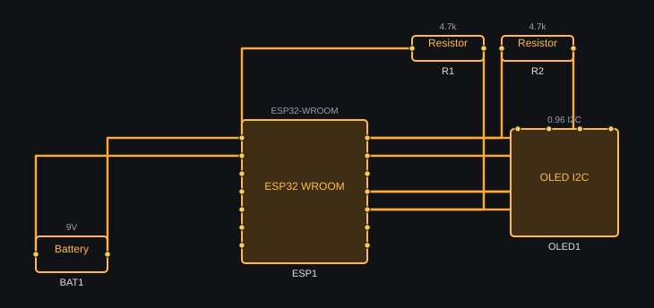

# Cluster

**초보자를 위한 ESP32/Arduino 회로도·시뮬레이션·PCB 설계 도구.**

Cluster는 메이커, 학생, 취미 개발자가 전자 회로를 쉽게 배울 수 있도록 만든 ESP32/Arduino 학습 및 프로토타이핑 도구다. KiCad 전체를 복제하는 대신, KiCad보다 배우기 쉽고 Fritzing보다 전기적 연결을 잘 이해하며 회로 검증부터 실제 2레이어 PCB 출력까지 이어지는 초보자용 KiCad-lite 작업 흐름을 목표로 한다.

Cluster는 오프라인 사용을 기본으로 설계했다. 사용자가 직접 공유하거나 내보내지 않는 한 회로 파일은 로컬에 남는다.



위 이미지는 내장 ESP32 + OLED 학습 회로를 Cluster 자체 SVG 내보내기로 생성한 것이다. 다음 명령으로 다시 만들 수 있다.

```bash
cargo run -- --export-demo-svg docs/media/cluster-overview.svg
```

---

## 왜 Cluster인가?

| 도구 | 사용 편의성 | 지능형 검증 | DC 시뮬레이션 | ESP32 중심 |
|---|---|---|---|---|
| KiCad | 어려움 | ✅ | 외부 도구(SPICE) | 범용 |
| Fritzing | 쉬움 | ❌ | ❌ | ✅ |
| Tinkercad | 쉬움 | ✅ | ✅ | 제한적 |
| **Cluster** | **쉬움** | **✅** | **✅** | **✅** |

Cluster는 **KiCad보다 쉽고**, **Fritzing보다 전기적으로 똑똑하며**, **초보자가 실제로 만드는 회로에 집중한다**.

---

## 주요 기능

### 회로 설계

- 검색 가능한 드래그 앤 드롭 부품 팔레트
- T 접합을 감지하는 직교 배선
- 수동 배선을 막지 않으면서 호환 목적지를 강조하고 의심스러운 핀 역할 연결을 경고하는 스마트 배선
- 그리드 스냅, 확대/축소, 화면 이동
- ESP32/Arduino I2C 예제용 브레드보드 배선 도우미
- 심볼, 풋프린트, 네트 클래스, 보드 레이어, 트랙, 비아, DRC를 위한 CAD 데이터 모델
- 다중 페이지 회로도
- 부품 라벨, 값, 회전
- 메모리 제한 델타 기반 실행 취소/다시 실행(한 번의 드래그는 편집 1건으로 기록)
- 복사/붙여넣기와 그룹 선택
- 부품 찾기, 정렬, 균등 분배

### 브레드보드 보기

브레드보드 보기는 회로도 네트리스트와 동기화되는 초보자용 배선 도우미다. 현재 ESP32/Arduino + OLED/센서 I2C 회로를 인식하고 다음 핵심 점퍼를 검사한다.

- ESP32 GPIO21 → OLED/센서 SDA
- ESP32 GPIO22 → OLED/센서 SCL
- Arduino A4 SDA → OLED/센서 SDA
- Arduino A5 SCL → OLED/센서 SCL
- VCC/3V3/5V와 공통 GND 레일

안내 점퍼를 클릭하면 대응하는 회로도 네트를 강조하여 추상적인 회로도와 실제 브레드보드 배선을 연결해 이해할 수 있다. 누락된 점퍼에는 매핑된 핀 사이에 회로도 배선을 추가하는 **배선** 작업도 제공한다.

### 사용자 부품(내 부품)

코드를 수정하지 않고 사용자 부품을 추가할 수 있다. Cluster 실행 위치 옆의 `cluster_parts/` 폴더에 부품별 JSON 파일 하나를 둔다.

```json
{
  "id": "user:bme280",
  "name": "BME280 Sensor",
  "chip_label": "BME280",
  "description": "Temperature/humidity/pressure sensor breakout (I2C)",
  "label_prefix": "U",
  "default_value": "BME280",
  "pins": [
    { "name": "VCC", "role": "positive", "side": "left" },
    { "name": "GND", "role": "ground",   "side": "left" },
    { "name": "SDA", "role": "i2c",      "side": "right" },
    { "name": "SCL", "role": "i2c",      "side": "right" }
  ]
}
```

- `id`, `name`, `pins`만 필수다. `width`/`height`를 지정하지 않으면 핀 수에서 본체 크기를 계산한다.
- 핀 `role`은 다음 중 하나다: `passive`, `positive`, `power_out`, `ground`,
  `digital`, `i2c`, `control`, `output`, `input`, `bidirectional`,
  `open_collector`, `no_connect`. 역할은 내장 부품과 같은 ERC 규칙(예: 접지 레일, I2C 풀업 검사)에 사용된다.
- 부품은 **내 부품** 팔레트에 나타난다. **새로 고침**은 폴더를 다시 읽고 **샘플 부품 만들기**는 복사해 쓸 BME280 예제를 생성한다.
- 사용자 부품도 내장 모듈처럼 배선, 네트리스트, ERC 검사, 저장, 불러오기를 지원한다. 시뮬레이션에서는 **심볼 전용**이며 DC 모델은 없다.
- 회로는 부품 `id`를 저장한다. JSON 파일이 없는 컴퓨터에서 열어도 부품과 배선은 보존하며 복원할 파일을 불러오기 메모로 알려준다.

### 지원 부품

- **마이크로컨트롤러**: ESP32, ESP32-S3, ESP32-C3, Arduino Uno, Raspberry Pi Pico
- **수동 소자**: 저항, 커패시터, 인덕터, 가변저항, 서미스터, 바리스터
- **다이오드**: 일반, LED, 제너, 쇼트키, TVS, 포토트랜지스터
- **트랜지스터**: NPN, PNP, N-MOSFET, P-MOSFET
- **전원**: 배터리, 전압원, 전류원, 전압 레귤레이터, 기준 전압
- **스위치**: 토글 스위치, 푸시 버튼, 슬라이드 스위치, 릴레이
- **IC**: 연산증폭기, 555 타이머, 논리 게이트(AND/OR/NOT/NAND/NOR/XOR), 범용 IC, 옵토커플러
- **주변 장치**: OLED 디스플레이, DC 모터, 서보, 센서, 모터 드라이버, 7세그먼트 표시기
- **기타**: 크리스털, 변압기, 퓨즈, 램프, 브레드보드, 네트 라벨

### PCB / 제작

Cluster는 영속 보드 데이터를 사용하는 전용 2레이어 PCB 작업공간을 제공한다.

- 회로도 `SymbolInstance`와 물리 `Footprint` 데이터 분리
- 간격, 트랙 폭, 비아 지름, 드릴을 위한 `NetClass` 규칙
- 외곽선, 레이어, 풋프린트, 트랙, 비아, 존, 설계 규칙을 담는 `Board` 데이터
- PCB 전용 팬, 줌, 그리드, 선택, F.Cu/B.Cu 표시
- 풋프린트 다중/영역 선택, 드래그, 회전, 뒤집기
- 수동 45°/90° 트랙 라우팅, 비아 배치, 동박 선택/삭제, 실행 취소/다시 실행
- 동박 아일랜드 랫츠네스트 계산: 실제 동박이 연결된 뒤에만 에어와이어 제거
- 수동 배치를 보존하고 제거된 부품을 조용히 삭제하지 않고 고아로 남기는 명시적 회로도→PCB ECO 보고
- 폭/비아 크기, 보드 가장자리/외부 동박, 서로 다른 네트 쇼트, 간격, 중복 참조명, 매달린 트랙/비아, 외곽선, 미배선 연결 DRC
- 오류 수준 DRC가 남으면 차단되는 Gerber/Excellon/BOM/CPL 제작 내보내기
- 오래된 엔티티/공간 인덱스, 풋프린트/패드 정의, 폴리곤 형상, 레이어 참조, 네트 클래스, 설계 규칙, CAD 네트 상호 참조를 검사하는 보드 무결성 검증. 구조 오류가 있으면 제작 내보내기는 차단하지만 프로젝트 저장/불러오기는 데이터를 보존하고 진단을 보고한다.

편집은 **작업공간 → PCB**에서 한다. 작은 하단 도크 미리보기는 상태와 진단 요약으로 유지한다.
현재 풋프린트 형상은 의도적으로 단순하며 패드 수준 대화형 편집, 동박 존, 솔더 마스크/실크스크린
제작 검사, ECO 적용 전 대화상자는 아직 미완성이다.

### 회로 검증(ERC)

Cluster는 변경할 때마다 전기 규칙 검사(ERC)를 자동 실행한다.

**오류(반드시 수정):**

- 전원 쇼트: 공급 전원이 GND에 직접 연결됨
- 회로도에 GND 기준 없음
- ESP32/Arduino 3.3V 핀이 5V 레일에 연결됨
- GPIO가 모터를 직접 구동함(드라이버 IC 필요)
- GPIO가 적절한 보호 없이 LED, 릴레이 코일, 서보, 램프를 구동함
- LED 극성 반대(애노드가 GND 네트에 연결됨)
- 다이오드 극성 반대
- OLED SDA/SCL 선이 뒤바뀜

**경고(수정 권장):**

- 전류 제한 저항 없는 LED
- 저항값이 없는 저항
- 전압값이 없는 배터리 또는 전압원
- 어떤 부품에도 연결되지 않은 부동 배선
- 연결되지 않은 부품 핀
- I2C SDA/SCL 풀업 저항 누락
- 플라이백 다이오드 없는 릴레이 코일

검증 메시지를 클릭하면 캔버스에서 문제가 있는 부품이나 배선을 선택한다. 일부 경고는 한 번에
수정하는 작업을 제공한다. I2C 풀업 수정은 4.7k 저항 2개를 배치해 컨트롤러 로직 레일에 연결하고,
릴레이 플라이백 수정은 COIL+/COIL- 사이에 역바이어스 다이오드를 배치해 연결한다.

### DC 시뮬레이션

Cluster는 수정 노달 해석(MNA)으로 다음 값을 계산한다.

- **네트 전압** — 각 노드의 전압(V)
- **분기 전류** — 각 부품을 통과하는 전류(A)
- **부품 전력** — 부품에서 소모되는 전력(W)

시뮬레이션 부품: 저항, 배터리, 전압원/전류원, LED(Vf≈2V), 다이오드(Vf≈0.65V), 제너, 쇼트키, 스위치(열림/닫힘), 가변저항, 퓨즈, 램프, DC 모터 근사 모델, NPN/PNP 트랜지스터(단순 동반 모델), MOSFET(반복 임계값 모델), 릴레이 코일/접점 연결성.

내장 해석기는 교육용 DC 동작점 해석기다. DC에서 커패시터는 개방, 인덕터는 단락으로 처리한다. 제한적인 과도 해석 MVP는 초보자용 RC 충·방전 회로와 RC 평활 미리보기용 PWM형 구형파 전원을 인식한다. 모터 기동, 임의 파형, 완전한 SPICE 과도 동작은 시뮬레이션하지 않는다. 심볼 부품은 인스펙터와 ERC에서 시뮬레이션 미지원으로 표시한다.

전류가 흐르는 배선은 주황색으로 강조하며 배선의 전압 라벨을 켜고 끌 수 있다. 개방 회로도
유효한 노드 전압을 유지하면서 `0 A`를 표시할 수 있다. 하나의 저장 배선 폴리라인에 분기가 있어
선분마다 전류가 다르면 오해를 부르는 단일 전류 화살표를 숨기고 접합점에서 전류가 달라진다고
알린다. DC 결과 모델은 기존 UI 필드와 함께 `node_voltages`, `component_currents`,
`wire_segment_currents`, `component_power` 그래프 필드를 보관한다. 해석기가 선분을 명확한 분기
전류와 연결할 수 있을 때만 선분 전류를 표시한다.

디버그 빌드의 **보기 → 성능 오버레이**는 추가 해석을 일으키지 않고 FPS, 렌더링/전체 캔버스
항목 수, MNA/ERC/네트리스트 시간, 흐름 입자 수, 시뮬레이션/네트리스트/흐름 캐시 적중 상태를 보여준다.

### 공학 값 입력

저항·커패시터·인덕터·전원 값은 `220R`, `4R7`, `1k`, `4.7k`, `1M`, `100nF`, `10uF`,
`10mA`, `3.3V` 같은 공학 표기를 지원한다. 대문자 `M`은 mega, 소문자 `m`은 milli로 해석한다.
숫자형 부품에 맞지 않는 단위나 알 수 없는 접미사는 인스펙터에서 즉시 안내하고 편집 이력에
적용하지 않는다. SPICE 내보내기는 ngspice의 `M = milli` 관례와 충돌하지 않도록 값을 비모호한
과학 표기법으로 변환한다.

### 내장 ESP32/Arduino 학습 예제

- 왼쪽 팔레트에서 예제 갤러리 사용
- 4.7k I2C 풀업을 포함한 ESP32 + OLED
- 4.7k 풀업을 포함한 ESP32 + I2C 센서
- ESP32 버튼 디바운스와 LED 출력
- ESP32 모터 드라이버 배선
- Arduino UNO + LED
- 4.7k I2C 풀업을 포함한 Arduino UNO + OLED

### 내보내기

- **SVG** — 회로도를 확장 가능한 벡터 그래픽으로 저장(`cluster_circuit.svg`)
- **SPICE 네트리스트** — LTspice/ngspice용 교육용 `.op` 네트리스트(`cluster_circuit.cir`)
- **BOM CSV** — 부품 주문용 자재 명세서(`cluster_bom.csv`)
- **Arduino 코드** — 연결된 ESP32/Arduino GPIO, 버튼, LED, OLED I2C 배선용 시작 스케치

SPICE 내보내기는 지원하는 기본 모델과 건너뛴 심볼 부품에 대한 주석을 포함한다. Arduino
내보내기는 펌웨어 합성이 아닌 시작 스케치이며 임의 모듈의 애플리케이션 동작을 추론하지 않는다.

Arduino 코드 생성은 컨트롤러가 하나인 페이지에서 실제 net 연결을 읽는다. 일반 신호는
`INPUT`으로 유지하고, 220Ω 이상 직렬저항과 컨트롤러 공통 GND를 가진 단순 LED 분기만
출력으로 구동한다. GND로 연결된 버튼은 풀업 입력과 50ms 디바운스 예제를 제공한다.
UNO의 `A0` 같은 아날로그 핀과 STM32의 `PB7` 같은 포트 이름을 보존한다.
OLED/I2C 센서는 공통 GND와 SDA/SCL 연결을 검사하며, 연결 누락·쇼트·여러 버스는
내보내기 전에 status에 원인을 표시한다. 생성 스케치는 Serial Monitor에 I2C 스캔 결과를
출력한다. OLED는 Adafruit GFX/SSD1306 라이브러리가 필요하며, 기본 주소 `0x3C`는 스캔에
맞게 수정한다. 초기화 실패가 다른 버튼/LED 동작을 멈추게 하지 않는다.
재내보내기는 `.ino.bak`와 이전 세대 백업을 남기고 원자적으로 교체한다.

ESP32는 [Arduino-ESP32 Wire API](https://docs.espressif.com/projects/arduino-esp32/en/latest/api/i2c.html),
Pico는 [Arduino-Pico core](https://arduino-pico.readthedocs.io/en/latest/wire.html),
STM32는 [STM32duino core](https://github.com/stm32duino/Arduino_Core_STM32/wiki/API)의
핀 설정 API를 사용한다. 해당 보드 코어를 선택한 뒤 컴파일·업로드한다.

### 저장 및 불러오기

- 스키마 버전을 추적하는 JSON 형식
- 스키마 v4는 명시적 배선 끝점(`Pin`, `Junction`, `FreePoint`)을 그려진 폴리라인 점과 별도로 저장
- `.bak`와 순환 백업 3세대를 포함한 원자적 임시 파일 교체
- 30초마다 `cluster_autorecover.json`에 자동 저장
- 손상되거나 오래된 스키마 파일은 불러올 때 복구하며 조용히 버리지 않음
- 끝점 메타데이터가 없는 레거시 파일은 불러올 때 한 번 마이그레이션한다. 핀에 닿는 배선 끝은 명시적 `PinRef`가 되고, 모호한 배선 중간 교차는 미연결 상태로 유지하며 불러오기 메모에 보고한다.
- PCB 도크는 `schematic.json`, `board.json`, `project.json`을 담은 `project.cluster/` 폴더를 저장하고 불러올 수 있다. 반복 저장도 일반 회로 저장과 같은 백업 안전 쓰기 경로를 사용한다.
- 사용자 부품 JSON 스키마 v2는 구조화 태그, 전압 범위, 인터페이스 맵, 풋프린트/패드 맵, 시뮬레이션 메타데이터, 문서를 지원하며 스키마 v1 심볼 전용 파일과 호환된다.
- 사용자 부품을 불러올 때 심볼릭 링크, 잘못된 파일, 1 MiB 초과 파일은 건너뛴다. 잘못된 부품 하나가 앱 전체를 중단하지 않는다.

---

## 설치

### 사전 요구 사항

- [Rust](https://rustup.rs/) 1.80 이상(2024 edition)

### 소스에서 빌드
```bash
git clone https://github.com/kyunghyunHan/Cluster
cd Cluster
cargo run --release
```

릴리스 바이너리는 `target/release/Cluster`에 생성된다.

CI는 Linux, macOS, Windows에서 소스를 빌드하고 테스트한다. 자동 태그 릴리스 패키징이 준비되기
전에는 위 명령으로 바이너리를 로컬에서 빌드한다.

---

## 사용법

### 부품 배치

1. 왼쪽 팔레트에서 부품 분류를 클릭하거나 검색창에 입력한다.
2. 캔버스를 클릭해 배치한다.
3. 배치 전이나 후에 **R**을 눌러 회전한다.

### 배선 그리기

1. **W**를 누르거나 도구 모음의 배선 도구를 클릭한다.
2. 부품 핀을 클릭해 배선을 시작한다.
3. 다른 핀을 클릭해 연결을 마친다.
4. 배선은 핀에 자동 스냅된다. 무관한 핀 위를 지나가는 배선은 그 핀에 연결되지 않는다.
5. 교차 배선과 접합점은 시각적으로 구분된다. 명시적 접합점/분기점이 없으면 교차해도 전기적으로 연결되지 않는다.

### 키보드 단축키

| 키 | 동작 |
|---|---|
| `W` | 배선 도구 |
| `Esc` | 선택 도구 / 현재 작업 취소 |
| `R` | 선택 부품 회전 |
| `Delete` | 선택 항목 삭제 |
| `Ctrl+Z` | 실행 취소 |
| `Ctrl+Y` | 다시 실행 |
| `Ctrl+C` | 선택 항목 복사 |
| `Ctrl+V` | 붙여넣기 |
| `Ctrl+S` | 회로 저장 |
| `Ctrl+O` | 회로 불러오기 |
| `F` | 화면에 맞추기 |
| `Space` | 시뮬레이션 켜기/끄기 |
| `Ctrl+F` | 부품 찾기 |

### 시뮬레이션 실행

**Space** 또는 도구 모음 버튼으로 시뮬레이션을 켜고 끈다. 활성 경로는 주황/노랑으로 빛난다. 배선이나 부품을 클릭하면 오른쪽 패널에서 전압, 전류, 소비 전력을 확인할 수 있다.

### 검증 결과 읽기

하단 ERC(전기 규칙 검사) 패널은 오류와 경고를 실시간으로 보여준다. 빨간 항목은 정상 동작을 막는 오류이고 노란 항목은 경고다. 메시지를 클릭하면 관련 부품이나 배선으로 이동한다.

---

## 프로젝트 구조

```
src/
  main.rs               # 앱 진입점
  model/
    component.rs        # ComponentKind 열거형, Component 구조체
    custom_part.rs      # 사용자 부품 JSON 스키마, 레지스트리, cluster_parts/ 로더
    pin.rs              # PinRole, CircuitPin, NetlistPin
    wire.rs             # 배선, 명시적 끝점, 연결성 ID
    ids.rs              # 직렬화 호환 런타임 타입 지정 ID
    net.rs              # Net, CircuitNetlist
    circuit.rs          # 카운터, 스냅샷, 저장/불러오기 타입
  engine/
    connectivity/       # 끝점/공간 인덱스, 교차, 접합점, union-find
    netlist.rs          # 정규 결정적 네트 생성과 회귀 픽스처
    erc/                # 규칙 컨텍스트, 레지스트리, 설정, 분리된 규칙 모듈
    validation.rs       # 남은 ERC 규칙과 구조화된 문제 메타데이터
    simulation.rs       # 시뮬레이션 결과 래퍼
    mna/                # 수정 노달 해석 DC 해석기
  ui/
    canvas/              # 보기 변환, 그리드/배경, 증분 캔버스 책임 경계
      view.rs            # 월드/화면 변환과 뷰포트 도우미
      background.rs      # 캔버스 표면과 줌 인식 그리드
      interaction.rs     # 스마트 배선 호환성 안내 경계
      current_flow.rs    # 캔버스 소유 전류 흐름 렌더링 경계
    app/
      mod.rs            # CircuitApp 상태와 주요 업데이트 루프
      canvas_helpers.rs # 적중 검사, 스냅, 배선 형상
      widgets.rs        # 상태 표시, 버튼, 학습 보고서
      energize.rs       # 배선 활성/연결성 분석
      overlays.rs       # 미니맵, 그리드, 시뮬레이션 요약
      symbols.rs        # 부품 심볼 그리기
      util.rs           # Arduino/SPICE/BOM 생성 도우미
      tests.rs          # 앱 수준 테스트
    validation_panel.rs # ERC 패널 UI 렌더러
  storage/
    save.rs             # 직렬화 도우미, 백업 쓰기
    autosave.rs         # 자동 저장 타이머 유틸리티
  export/
    svg.rs              # SVG 회로도 내보내기
```

---

## 시뮬레이션 제한

Cluster의 MNA 해석기는 교육용이며 SPICE를 그대로 대체하지 않는다.

- **교육용 DC 동작점**과 제한적인 RC/PWM 과도 미리보기
- DC 해석에서 커패시터는 개방 회로
- DC 해석에서 인덕터는 단락 회로
- 다이오드, LED, MOSFET은 단순화한 반복 구간별 모델 사용
- BJT는 완전한 Ebers-Moll 트랜지스터 시뮬레이션이 아닌 단순 동반 모델
- 과도 해석은 인식된 RC 경로 하나와 DC/PWM형 전원 값으로 제한
- 특이하거나 수렴하지 않는 회로는 패닉 없이 안전한 실패 반환
- 분기 폴리라인은 선분마다 전류가 다를 수 있으며 이때 임의의 네트 전체 전류 값을 만들지 않음

제품 수준 시뮬레이션에는 내보낸 네트리스트를 LTspice에서 확인·보완하거나 시뮬레이션 도구
모음에서 선택적 ngspice 과도 해석 백엔드를 선택한다. `ngspice` 실행 파일이 없으면 해결 방법이
있는 오류를 표시한다. 내보내기 기능만으로 내장 해석기가 SPICE 수준으로 정확해지는 것은 아니다.

시뮬레이션 상태는 **정상**, **경고**, **실패**로 표시한다. 경고는 편집기가 유용한 연결성이나
전압을 보여줄 수 있지만 수치 동작점을 확인해야 한다는 뜻이다. 실패는 이상 전원 충돌처럼 회로가
안전하지 않거나 수학적으로 해석할 수 없다는 뜻이다.

---

## 성능 기준선

저장소에는 `benches/performance.rs`의 결정적 Criterion 픽스처와
`examples/performance_probe.rs`의 백분위수/힙 프로브가 있다. 실행 방법은 다음과 같다.

```text
cargo bench --bench performance
CLUSTER_PERF_SAMPLES=21 cargo run --release --example performance_probe
```

현재 재현 가능한 3회 실행 기준선과 감사 절차는
`docs/architecture/commercial-completion-audit-2026-07-23.md`에 기록되어 있다. 프로브는 연결성을
포함한 집계 작업과 별도로 ERC 규칙 평가 및 MNA 해석기 시간을 보고하며 값 전용·토폴로지 전용
ERC도 측정한다. 2026-07-23 작업에서 네트 인덱스 기반 ERC 평가는 대형 규칙 전용 p95를
`97.8833 ms`에서 `4.3620 ms`로 줄였고, 범위 지정 명령 델타는 배선 추가/분할 p95를
`10.6827 ms`에서 `0.8900 ms`로 줄였다. 대형 오프스크린 egui p95는 `2.5437 ms`, UI 스레드
자동 저장 DTO p95는 `1.3058 ms`였다. MNA 토폴로지 재사용과 로컬 증분 연결성은 미완료 상태다.
아래 과거 p50 값은 arm64 macOS에서 `e613665`와 이전 변경을 비교한다.

이후 전체 제품 감사에서 기존 합성 MNA 행에 GND가 없어 행렬 풀이 시간이 아니라 준비부터
`NoGround`까지를 측정했다는 사실을 확인했다. 현재 이름은 `mna_prepare_no_ground_*`다. 해석 가능한
혼합 픽스처는 실제 해석기 전용 및 연결성 재사용 매개변수 업데이트 행을 보고한다(3회 실행 p95
`2.1913 ms`, `2.2650 ms`). 이는 컴파일된 MNA 토폴로지 캐시를 뜻하지 않으며 여전히 회로를 다시
컴파일한다. 각 회로 행은 표시한 정확한 부품/선분 수를 사용하고 시간 단위는 밀리초다. 로컬 DRC
기준선은 예전의 잘린 보드 근사를 사용했지만 새 결과는 전체 보드에서 영향받은 트랙 128개를 검증한다.

| 작업 | 100 / 300 변경 전 → 후 | 500 / 2,000 변경 전 → 후 | 1,000 / 5,000 변경 전 → 후 |
| --- | ---: | ---: | ---: |
| 캐시 프레임 CPU 모델 | 0.0034 → 0.0033 | 0.0238 → 0.0238 | 0.0479 → 0.0481 |
| 적중 검사 | 0.0015 → 0.0031 | 0.0098 → 0.0096 | 0.0230 → 0.0230 |
| 연결성 | 3.25 → 4.41 | 48.99 → 48.71 | 238.94 → 235.92 |
| ERC | 6.92 → 4.08 | 166.13 → 59.23 | 990.44 → 327.59 |
| MNA | 3.68 → 3.58 | 64.93 → 64.19 | 334.31 → 330.46 |
| JSON 저장 | 0.294 → 0.306 | 1.822 → 1.852 | 4.469 → 4.413 |

| PCB/이력 작업 | 변경 전 p50 | 변경 후 p50 |
| --- | ---: | ---: |
| PCB 적중 검사, 풋프린트 250 / 트랙 2,000 / 비아 150 | 0.0026 ms | <0.0001 ms |
| PCB 로컬 DRC | 0.256 ms | 3.005 ms |
| PCB 전체 DRC | 16.843 ms | 7.132 ms |
| 랫츠네스트 | 0.482 ms | 0.470 ms |
| 실행 취소 + 다시 실행, 1,000 / 5,000 | 2.172 ms | 2.114 ms |
| 저장 스냅샷 복제, 1,000 / 5,000 | 0.360 ms | 0.354 ms |

가장 큰 캐시 프레임 작업에서 변경 전/후 p50/p95/최댓값은
`0.0479/0.0597/0.0597 ms` → `0.0481/0.0676/0.0676 ms`였다. 로컬 DRC의 최대 증분 힙은
360,452바이트에서 4,080바이트로 줄었고 전체 DRC는 681,006
바이트였고 저장 스냅샷 힙은 1,382,179에서 1,375,770바이트로 줄었다. 원시 프로브 출력이 승인
기록이며 Criterion은 통계적 회귀 도구로 유지한다.

분석은 제한된 리비전 태그 작업자에서 실행한다. 오래된 연결성, ERC, MNA, 과도 해석, 전체 DRC
결과는 버리고 자동 저장 JSON 직렬화와 파일 시스템 I/O는 더 이상 UI 스레드를 막지 않는다.
PCB 적중 검사, 컬링, 스냅, 라우팅 대상, DRC는 엔티티/공간 인덱스를 사용한다. 디버그 성능
오버레이는 실시간 프레임 p50/p95/최댓값과 캐시 상태를 표시한다.

### 2026-07-22 빈번 실행 경로 개선 (`c554858` 작업 트리)

`frame_*`는 `synthetic_canvas_cpu_*`로 이름을 바꿨다. 작은 CPU 마이크로벤치마크로 의도적으로
유지하며 더 이상 UI 프레임으로 표현하지 않는다. 새 `egui_frame_*` 픽스처는 오프스크린
`egui::Context`에서 실제 `CircuitApp::update_ui`, 패널 배치, 캔버스 그리기, 테셀레이션 경로를 실행한다.

| 오프스크린 상태 | 전체 p50 / p95 / 최댓값 | 업데이트 p50 | 테셀레이션 p50 |
| --- | ---: | ---: | ---: |
| 빈 회로 | 0.426 / 0.568 / 0.568 ms | 0.314 ms | 0.102 ms |
| 소형 회로도 | 1.084 / 1.309 / 1.309 ms | 0.834 ms | 0.240 ms |
| 중형 회로도 | 2.188 / 2.444 / 2.444 ms | 1.575 ms | 0.585 ms |
| 대형 회로도 | 3.089 / 3.277 / 3.277 ms | 2.078 ms | 0.969 ms |
| 검증 패널 열림 | 1.608 / 4.096 / 4.096 ms | 1.290 ms | 0.292 ms |
| 인스펙터 선택 | 1.518 / 1.904 / 1.904 ms | 1.201 ms | 0.300 ms |
| 시뮬레이션 애니메이션 | 1.289 / 1.497 / 1.497 ms | 0.996 ms | 0.283 ms |
| PCB 작업공간 | 0.622 / 0.776 / 0.776 ms | 0.506 ms | 0.111 ms |
| 브레드보드 작업공간 | 1.565 / 1.747 / 1.747 ms | 1.185 ms | 0.344 ms |

대형 프레임 p50의 상단/왼쪽/오른쪽/하단 패널 분해 결과는
`0.036/0.314/0.011/0.021 ms`, 캔버스 준비 `0.095 ms`, 배선 그리기 `0.144 ms`, 심볼 그리기
`0.304 ms`, 나머지 오버레이/입력 `1.149 ms`다. 대형 뷰포트는 부품 130개와 배선 선분
242개를 도형 11,155개와 테셀레이션 기본 요소 16개로 렌더링한다.

이 개선 전 로컬 릴리스 프로브와 최종 프로브의 p50 값은 다음과 같다. 집계 ERC/MNA 행은 정규
연결성을 포함한다. 성능 저하는 숨기지 않고 기록했으며 후속 작업으로 남긴다.

| 부품 1,000개 / 선분 5,000개 대형 작업 | 변경 전 | 변경 후 |
| --- | ---: | ---: |
| 연결성 | 72.95 ms | 59.73 ms |
| ERC | 163.54 ms | 198.68 ms |
| MNA 집계 작업 | 166.41 ms | 187.82 ms |
| 최대 증분 힙 | 5,993,292 B | 5,993,308 B |

접점 후보/정확 검사/합치기 작업은 이제 한 번만 수행하고 그 분할점을 정규 배선 선분 구성에서
재사용한다. 첫 단계별 프로브는 반복 정규화 검사 `31.28 ms`를 포함해 총 `84.51 ms`였다.
재사용 뒤에는 총 `57.05 ms`이며 후보 조회 `26.22 ms`, 정확 검사 `2.90 ms`, 접합점 합치기
`7.09 ms`, 초기 union-find `4.99 ms`, 라벨 `0.19 ms`, 네트 구성 `10.73 ms`, 정렬
`0.16 ms`, 진단 `2.92 ms`가 되었다.

해석 가능한 혼합 비선형 MNA 픽스처의 컴파일/노드 인덱싱/할당/스탬핑/비선형 처리/풀이/수렴/
결과/배선 매핑은 각각 `2.00/0.02/0.01/0.00/0.11/0.09/0.03/0.49/0.26 ms`이며
총 `2.60 ms`다.
토폴로지/매개변수 구조 재사용은 아직 구현하지 않았다.

실제 명령 + 실행 취소 + 다시 실행 + 실행 취소 p50 값은 다음과 같이 개선되었다.

| 명령 | 변경 전 | `d67dde5` | 현재 |
| --- | ---: | ---: | ---: |
| 부품 1개 이동 | 82.08 ms | 0.76 ms | 0.76 ms |
| 부품 100개 이동 | 74.18 ms | 1.76 ms | 1.76 ms |
| 부품 회전 | 71.68 ms | 0.68 ms | 0.68 ms |
| 속성 편집 | 66.56 ms | 0.09 ms | 0.09 ms |
| 배선 추가/분할 | 64.88 ms | 79.11 ms | 16.12 ms |
| PCB 트랙 라우팅 | 74.12 ms | 0.35 ms | 0.35 ms |
| 비아 추가 | 69.94 ms | 0.34 ms | 0.34 ms |
| 풋프린트 이동 | 82.69 ms | 0.33 ms | 0.33 ms |

이동/회전/속성/제어점 명령은 영향받은 엔티티만 캡처하며 이력 이동도 영향받은 공간/부착 항목만
갱신한다. 공유 회로도 인덱스는 개별 배선 선분을 저장하고 결정적 핀 후보를 사용하며, 모든 부품
핀을 다시 만들거나 모든 부착 맵을 정렬하지 않고 부착 키를 갱신한다. 명령 커밋은 디버그 불변
검사를 마친 뒤 파생 인덱스 3개의 태그를 바꿔 다음 명령에서 조용히 다시 구성되지 않게 한다.
추가, 붙여넣기, 삭제, 정렬, 문서/페이지, 드래그 트랜잭션에는 아직 전체 스냅샷 대체 경로가 있다.
배선 추가/분할은 후속 74% 개선 뒤에도 측정된 회로도 명령 중 가장 느리다.

PCB 풋프린트 회전과 뒷면 뒤집기는 이제 패드 조회와 PCB 공간 인덱스에서 하나의
`FootprintTransform`을 공유한다. Gerber 패드 플래시와 Excellon 드릴 좌표도 같은 변환을 쓰며,
Excellon은 실제 비아/패드 공구 크기를 출력하고 CPL은 뒷면 배치를 기록한다. 사분면/뒤집기,
변환된 Gerber, Excellon, CPL 좌표 테스트가 이 제작 경계를 검사한다. 동박 존 채움, 마스크 확장,
완전한 외부 골든 파일 픽스처는 미완성이다.

마지막 지속 전체 모음 프로브에서 대형 연결성/ERC/MNA 집계 p50은
`76.88/222.83/228.52 ms`, 최대 증분 힙은 `5,993,340 B`였다. 앞선 단독 프로브보다 느렸고
관측값 그대로 기록했다. 같은 실행에서 무관한 저장, PCB, 합성 마이크로벤치마크도 느려졌으므로
차이의 원인을 판단하려면 열 상태를 통제한 기준선이 더 필요하다. 실제 대형 오프스크린 egui의
p50/p95/최댓값은 `4.128/8.486/8.486 ms`였다. 최종 집중 재실행에서는 고밀도 핀 조회
`132.66 ns`, 전체 회로도 뷰포트 조회 `1.039 ms`, 배선 추가/분할/실행 취소/다시 실행
`16.12 ms`를 측정했다.

## 로드맵

### 완료

- 초보자 예제 갤러리와 I2C 브레드보드 배선 도우미
- 정규 결정적 다중 페이지 네트리스트와 레지스트리 기반 초보자 ERC
- PCB 편집기 MVP: 풋프린트 이동/회전/뒤집기, 트랙 끝점/선분 드래그, 2레이어 45°/90° 라우팅, 비아, 동박/외곽선 편집, 선택, 실행 취소/다시 실행
- CAD/PCB 모델, 프로젝트 폴더 왕복, DRC 기반 제작 차단, Gerber/Excellon 및 BOM/CPL 내보내기
- 인덱스·델타 기반 명령/이력 경계와 리비전 태그 분석 작업자
- 도구 모음에서 선택 가능한 ngspice 과도 해석 내보내기/실행/가져오기 백엔드
- Linux/macOS/Windows 압축 파일, SHA-256 체크섬, 노트를 만드는 태그 릴리스 워크플로

### 진행 중

- 모든 페이지의 접합점/미연결 작성 UI 완성
- PCB 작업공간의 클릭 가능한 패드/홀/실크스크린/마스크 DRC 탐색
- 편집 가능한 실제 브레드보드 점퍼, 전원 레일, 핀 강조
- 라이브러리 관리자 2단계: 프로젝트 라이브러리, 풋프린트 편집기, 부품 편집기
- 증분 연결성, 부분 ERC 실행, MNA 토폴로지 캐싱

### 다음 단계

- `.cluster` 프로젝트 번들, 최근 프로젝트, 썸네일, 충돌 복구 브라우저
- 패드 간 라우팅 충돌 안내와 동박 존 다시 채우기
- 내보내기 마법사와 ngspice 결과 그래프
- 데이터 기반 학습 체크포인트를 안내형 튜토리얼 UI 및 영속성에 연결

### 장기 계획

- 고급 PCB 마스크, 존, 차동 쌍, 제작 검사
- 외부 해석기 모델을 통한 폭넓은 혼합 신호 시뮬레이션
- 협업 검토와 재사용 가능한 조직 라이브러리


## 기여하기

이슈와 풀 리퀘스트를 환영한다. 큰 변경은 먼저 이슈로 논의해 주세요.

구현 경계는 [아키텍처 문서](docs/architecture.md), 로컬 품질 게이트와 성능 측정 방법은
[테스트 문서](docs/testing.md)를 참고해 주세요.


## 라이선스

MIT — 자세한 내용은 [LICENSE](LICENSE) 참고.


*[egui](https://github.com/emilk/egui)와 [eframe](https://github.com/emilk/egui/tree/master/crates/eframe)으로 제작했습니다.*
